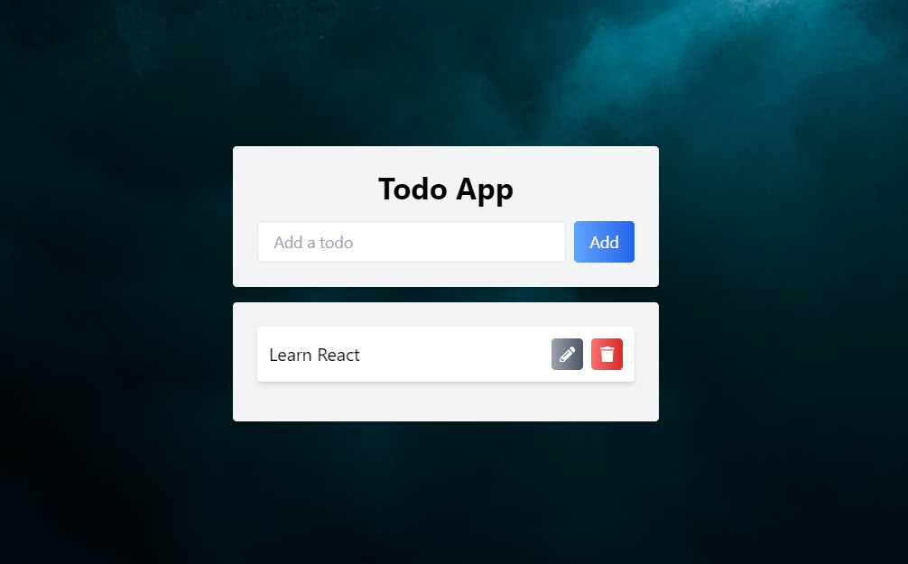

# DevOps <!-- Internship --> Assignment

## Assignment Overview
Dockerizing a simple todo web application (vite+react), deploy it to a Kubernetes cluster using Argo CD, and manage its release process with Argo Rollouts. The assignment consists of four main tasks: setup and configuration, creating the GitOps pipeline, implementing a canary release, and documentation.
<div align="center">

</div>

## Task 1: Setup and Configuration

### Create a GitRepository
- GitHub Repo: [devops-argocd](https://github.com/acodenil/devops-argocd)

### Install Argo CD on Kubernetes Cluster
- Following the Official Argo CD documentation to install and configure Argo CD on Amazon EKS Kubernetes cluster.

### Challenges Encountered
- Configuring AWS CLI and IAM roles required careful attention to ensure proper authentication and permissions.
- Setting up the LoadBalancer for Argo CD's UI involved configuring network settings and verifying connectivity.

### Steps
1. Launch and connect to EC2 instance.
2. Install aws cli.
    ```
    curl "https://awscli.amazonaws.com/awscli-exe-linux-x86_64.zip" -o "awscliv2.zip"
    sudo apt install unzip
    unzip awscliv2.zip
    sudo ./aws/install -i /usr/local/aws-cli -b /usr/local/bin –update
    ```
3. Created an IAM Role for EKS management in AWS Console.
    - Go to the AWS IAM console.
    - Create a new IAM user named "role-name."
    - Attach the "AdministratorAccess" policy to this user(for testing purpose).
    - Create Security Credentials.
4. Configure the AWS CLI with the Access Key and Secret Access Key.
    ```
    aws configure
    ```
5. Install kubectl.
    ```
    curl -o kubectl https://amazon-eks.s3.us-west-2.amazonaws.com/1.19.6/2021-01-05/bn/linux/amd64/kubectl
    chmod +x ./kubectl
    sudo mv ./kubectl /usr/local/bin
    kubectl version --short –client
    ```
6. Install eksctl.
    ```
    curl --silent --location "https://github.com/weaveworks/eksctl/releases/latest/download/eksctl_$(uname -s)_amd64.tar.gz" | tar xz -C /tmp
    sudo mv /tmp/eksctl /usr/local/bin
    eksctl version
    ```
7. Use eksctl to create the EKS cluster.
    ```
    eksctl create cluster --name devops-argocd --region ap-south-1 --node-type t2.large --nodes-min 2 --nodes-max 2
    ```

### Argo CD on Kubernetes Cluster
#### Installation
- Install Argo CD on Kubernetes Cluster.
    ```
    kubectl create namespace argocd
    kubectl apply -n argocd -f https://raw.githubusercontent.com/argoproj/argo-cd/v2.4.7/manifests/install.yaml
    ```

#### Expose argocd-server
- Expose argocd-server service.
    ```
    kubectl patch svc argocd-server -n argocd -p '{"spec": {"type": "LoadBalancer"}}'
    ```

## Task 2: Creating the GitOps Pipeline

### Dockerize the Application
- The web application is being Dockerized using a Dockerfile that defines the build and deployment process.

#### Challenges Encountered
- Configuring Docker and ensuring a smooth build process required attention to dependencies and file structure within the Docker container.

#### Steps
1. Docker install.
    ```
    sudo apt-get install docker.io
    sudo usermod -aG docker $USER
    sudo reboot
    ```
2. Build a Docker image using the Dockerfile.
    ```
    docker build -t todo-react .
    ```
3. Tag the image for pushing to Docker Hub.
    ```
    docker tag todo-react:latest banil51/todo-react:latest
    ```
4. Push the Docker image to a public container registry: Docker Hub.
    ```
    docker push banil51/todo-react
    ```

### Deploy the Application Using Argo CD
- Manifests
    - [todo-react-deployment.yaml](manifests/todo-react-deployment.yaml)
    - [todo-react-service.yaml](manifests/todo-react-service.yaml)

- Add an Argo CD application manifest to the repository, specifying the Git repository URL and target cluster.
    - [argocd-application.yaml](argocd-application.yaml)

- Create namespace and apply the above manifest:
    ```
    kubectl create namespace todo-react
    kubectl apply -f argocd-application.yaml
    ```

- Go to load balancer DNS of the todo-react-service (automatically created by ArgoCD):
    ```    
    kubectl get svc -n todo-react
    ```

#### Configure Argo CD
- The application will auto-sync based on the sync policy defined in the Argo CD configuration.

## Task 3: Implementing a Canary Release with Argo Rollouts

### Define a Rollout Strategy
- The application's deployment is modified to use Argo Rollouts, specifying a canary release strategy in the rollout definition.

    - [argo-rollout-app.yaml](argo-rollout-app.yaml)
    - [argo-rollout-service.yaml](argo-rollout-service.yaml)

#### Canary Strategy
- The canary deployment strategy gradually introduces changes to your application.
    - The canary deployment strategy gradually introduces changes to your application:
    - Initially, 20% of traffic is directed to the new version, allowing for cautious testing (setWeight: 20).
    - A pause follows for observation (pause: {}). 
        which should be resumed by promoting (manually):
    - kubectl argo rollouts promote todo-rollout
    - The proportion of traffic increases to 40%, expanding exposure to the new version (setWeight: 40).
    - Another pause allows for further monitoring (pause: {duration: 10}).
    - This process repeats, with traffic proportions increasing by 20% increments and pauses for observation, until reaching 80% exposure to the new version.

### Trigger a Rollout
- A new version of the application is built and pushed to the Docker Hub, and the rollout definition was updated to use this new image.

#### Challenges Encountered: 
- Coordinating the rollout process and ensuring smooth transitions between canary phases required coordination and monitoring.


    Build a new Docker image and push it to the container registry.
    ```
    docker build -t todo-react:roll .
    docker tag todo-react:roll banil51/todo-react:roll
    docker push banil51/todo-react:roll
    ```
    Update the rollout definition to use the new Docker image.
    ```
    kubectl argo rollouts set image todo-rollout todo-react-container=banil51/todo-react:roll
    ```
    manual promote command for (pause: {}):
    ```
    kubectl argo rollouts promote todo-rollout
    ```

### Monitor the Rollout
- Using Argo Rollouts to monitor the deployment of the new version, ensuring the canary release is completed.
    
    Using the command-line interface to monitor the progress of the rollout.
    ```
    kubectl argo rollouts get rollout todo-rollout --watch
    ```

## Task 4: Documentation and Cleanup

### Documentation
- The documentation summarizes the steps taken, including explanations of key actions, challenges encountered, and how they were resolved.

### Clean Up
- Remove all resources created during this assignment from the Kubernetes cluster.

    Delete the Argo CD application and Argo CD.
    ```
    kubectl delete -f argocd-application.yaml
    kubectl delete namespace todo-react
    ```
    
    Remove the Argo Rollouts resources.
    ```
    kubectl delete rollout todo-rollout
    ```
    
    Remove the Argo CD and Rollouts 
    ```
    kubectl delete namespace argocd
    kubectl delete namespace argo-rollouts
    ```
    Delete the Kubernetes cluster 
    ```
    eksctl delete cluster --name devops-argocd --region ap-south-1
    ```

Documentation: 
    [Google Docs](https://docs.google.com/document/d/1eEye7UZQlJsLcvepLjeI53uHRu_mhyKtRkl8swx3iGQ/edit?usp=sharing)
